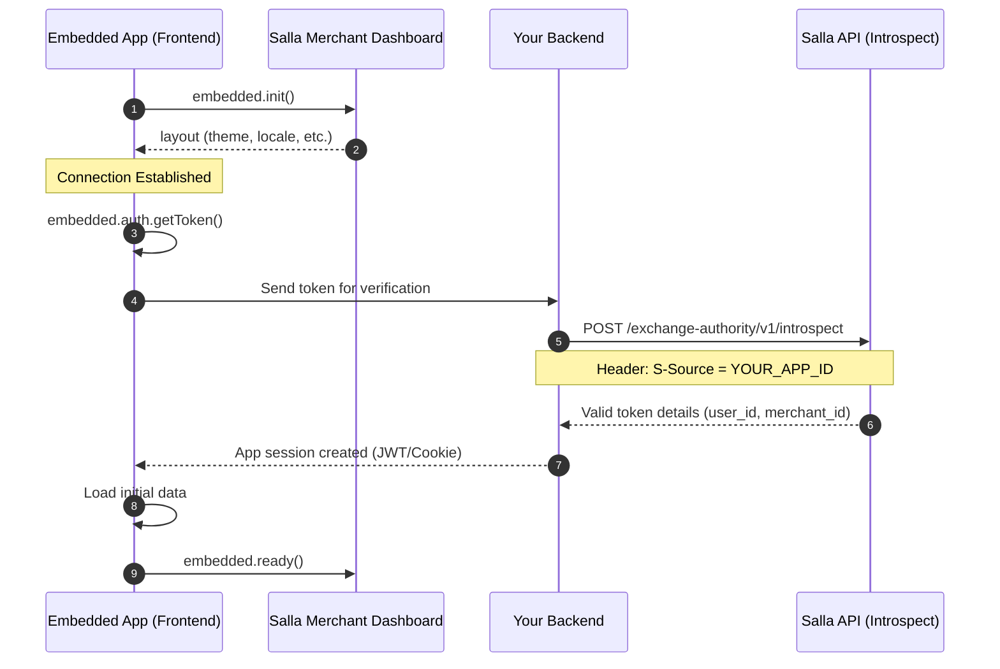
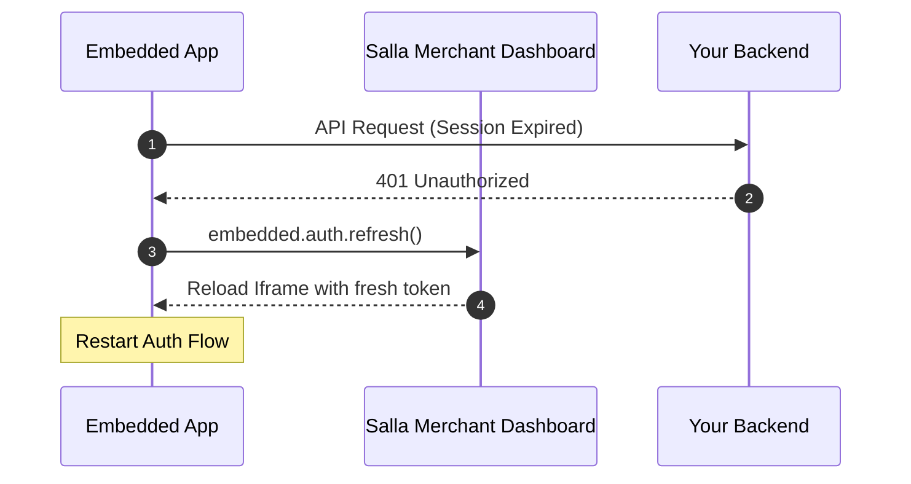

# Authentication

In the Salla ecosystem, authentication for embedded apps is built on a "Trust-but-Verify" model. When a merchant opens your app, Salla passes a short-lived session token through the iframe URL. Your app is responsible for capturing this token and verifying it with your backend to establish a secure session.

### What you'll learn:
- [Authentication Flow](#the-authentication-flow)
- [Frontend Implementation](#frontend-implementation)
- [SDK Method Reference](#sdk-method-reference)
- [Backend Verification](#backend-verification)
- [Handling Token Expiration](#handling-token-expiration)


## The Authentication Flow

The following diagram illustrates the complete production flow. It starts with the SDK initialization and ends with the app signaling it is ready for use.



## Frontend Implementation

Your frontend acts as the courier. It gathers the necessary context and hands it off to your server.

<Steps>
  <Step title="Initialize the Connection">
    Call `await embedded.init()` to establish the postMessage bridge with the Salla Dashboard.
  </Step>
  <Step title="Retrieve the Token">
    Use `embedded.auth.getToken()` to extract the short-lived token from the URL.
  </Step>
  <Step title="Verify with Backend">
    Send the token to your server. **Do not** perform business logic based on an unverified frontend token.
  </Step>
  <Step title="Signal Readiness">
    Only after your backend confirms the session and your data is loaded, call `embedded.ready()`.
  </Step>
</Steps>

## SDK Method Reference

The `embedded.auth` and core modules provide several helpers to manage the lifecycle:

<Tabs>
  <Tab title="embedded.auth.getToken()">
    Returns the session token passed in the URL.

    ```javascript
    const token = embedded.auth.getToken();
    if (!token) {
      // Handle case where app is opened outside Salla
    }
    ```
  </Tab>
  <Tab title="embedded.auth.refresh()">
    Triggers a reload of the iframe with a fresh token. Use this when your backend reports an expired session.

    ```javascript
    // Call this to get a new token from the host
    embedded.auth.refresh();
    ```
  </Tab>
  <Tab title="embedded.onInit()">
    A listener that fires once the SDK is ready.

    ```javascript
    embedded.onInit((state) => {
      console.log("Authenticated context:", state.layout);
    });
    ```
  </Tab>
</Tabs>

## Backend Verification

Your backend must verify the token via [Salla's Introspection API](https://docs.salla.dev/embedded-sdk/endpoint-tokent-introspect.md). This ensures the request is genuine and identifies the specific merchant and user.


**Method:** `POST`  
**URL:** `https://api.salla.dev/exchange-authority/v1/introspect`  
**Header:** `S-Source: YOUR_APP_ID`

**Request Body:**

<Tabs>
  <Tab title="Exmaple">
```json
{
  "token": "em_tok_..."
}
```
    </Tab>
  <Tab title="Schema">
<DataSchema id="12676504" />
  </Tab>
</Tabs>


**Successful Response:**


<Tabs>
  <Tab title="Exmaple">

```json
{
  "status": 200,
  "success": true,
  "data": {
    "merchant_id": 123456,
    "user_id": 987654,
    "exp": "2026-01-19T12:00:00Z"
  }
}
```
    </Tab>
  <Tab title="Schema">
<DataSchema id="12676484" />
  </Tab>
</Tabs>


## Handling Token Expiration

If your backend returns a `401 Unauthorized` or indicates the token has expired, you should initiate the refresh flow:



:::highlight blue 💡
**Best Practices**
*   **Keep Tokens Short-Lived**
    Salla's embedded tokens are designed to be temporary. Use them only to establish your own app session (e.g., via a secure cookie or a JWT).
*   **Validate the `S-Source` Header**
    When calling the introspection API, always provide your unique `App ID` in the `S-Source` header. This prevents other apps from trying to verify tokens against your identity.
*   **Call `embedded.ready()`**
    The Salla Dashboard displays a loading overlay until you call `ready()`. If your authentication fails, use `embedded.destroy()` to exit gracefully rather than leaving the merchant on a hung loading screen.
    :::


## Next Steps
<CardGroup cols={2}>
  <Card title="App Design Guidelines" href="../getting-started/design-guidelines" icon="material-outline-apps">
    Browse the full list of available modules to enhance your app's functionality.
  </Card>

  <Card title="Start Developing" href="./playground" icon="material-outline-code">
    Explore the playground to boost your embedded app implementation.
  </Card>
</CardGroup>
